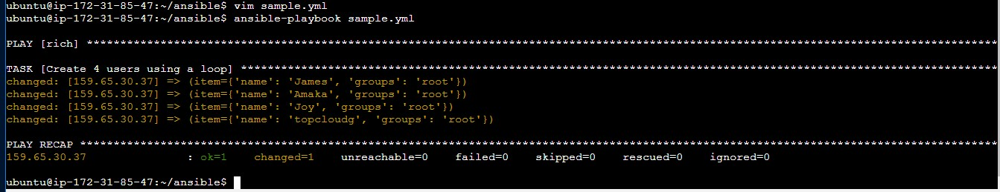

## Loops in Ansible

### Ansible Loops are used to automate repeated tasks defined in a playbook. Just like in programming, we can use loops to do a specific task repeatedly instead of writing the code multiple times.


### To use Ansible loops is super easy and straight-forward. We use the keyword "loop" to specify the number of times you want a task to run  and "{{ item }}" to call the task. Today we are going to create multiple users on a server using a single task to demonstrate the usage of ansible loops.

- Create a playbook to write the requisite code. We will call ours "loop.yml"
```
vim loop.yml
```
- In our playbook, we declare the hosts and escalated commands
```
- hosts: all
  become: true
  tasks:
```
- Then we'll write a task to create users on a remote server using the "user" module. Instead of writing the name of the user you want to create, use the "{{ item }}" variable instead. The item variable is a built in variable used in Ansible loops so you don't need to worry about defining it elsewhere in your playbook.
```
- hosts: all
  become: true
  tasks:
    - name: create multiple users on a server
      user: 
        name: "{{ item }}"
        groups: root
        owner: root
        state: present
```
- After writing the above, you need to specify the names of new users you want to create using the "Loop" module.
```
- hosts: all
  become: true
  tasks:
    - name: create multiple users on a server
      user: 
        name: "{{ item }}"
        groups: root
        owner: root
        state: present
      loop:
        - James
        - Amaka
        - Joy
        - TopcloudG
```
- After this, run the playbook using this command.
```
ansible-playbook loop.yml
```

- You should get an output like this

This means the playbook ran as intended. We can also check the users on our remote machines
